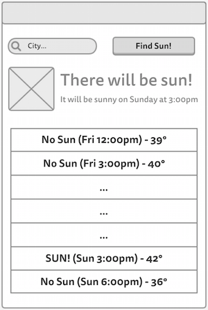

# Sun Spotter
It's spring time! That means a rare treat for the Pacific Northwest: sunshine! For this assignment, you will build a small mobile app that will let users find out if and when there will be any sun nearby so that they can enjoy its limited appearance.

### Objectives
By completing this challenge you will practice and master the following skills:

* Creating new Android activities
* Defining complex layout using XML resources
* Using Android View elements
* Using composite Views and adapters
* Downloading data from the Internet
* Accessing and parsing data from public APIs using Java

## User Stories
The functionality of projects in this class&mdash;that is, the things you can do with an app&mdash;will be defined by [**user stories**](https://en.wikipedia.org/wiki/User_story). User stories are a technique from [Agile software development](http://en.wikipedia.org/wiki/Agile_software_development) and are short, plain-English descriptions of a single piece of functionality. Most apps can let the users do lots of things, and so may have lots of different user stories.

The user stories for the Sun Spotter app are:
* As a user, I want to specify my location so I can see if there will be sunshine near me.
* As a user, I want to see if and when there will be any sun in the near future.
* As a user, I want to see a future weather forecast so I can plan to spend time in the sun.


### Layout and Appearance
Your SunSpotter app should run in a single Activity (screen), following the rough mock-up below:



At the top the user should be able to [enter](http://developer.android.com/reference/android/widget/EditText.html) their city name and hit a "Search" [button](http://developer.android.com/reference/android/widget/Button.html) (alternatively, you can have the user enter a zip code instead--just <a href="prompt">http://developer.android.com/reference/android/widget/TextView.html#attr_android:hint</a> them for the intended input).

Beneath the form there should be a View that shows whether there is going to be any sun in the next few days, and if so when that _first_ sun will be. It should also show a [picture](http://developer.android.com/reference/android/widget/ImageView.html) for whether there is weather (e.g., a sun if there will be sun, clouds otherwise).
- You can find some pictures online and load them from the `res/drawable` folder, changing the appropriate <a href="http://developer.android.com/reference/android/widget/ImageView.html#attr_android:src">attribute</a> depending on the result of the search.
- The OpenWeatherMap API you'll be accessing also has a [set of icons](http://openweathermap.org/weather-conditions#How-to-get-icon-URL) that can work.

Finally below that is a _scrollable_ [list](http://developer.android.com/reference/android/widget/ListView.html) of the tri-hourly forecast for the next few days, emphasizing whether there is sun or not.
- You don't need to show all the forecast details like high/low temperature or pressure (though temperature is nice to include); you're only required to show the temperature and whether there will be sun at that time!

Note that this is only a rough mock-up&mdash;any styling (font, colors, margins, etc) and other appearance details are up to you. But you should include all of the components indicated, in their relative positions.
- **Helpful hint**: you can find a list of layout and View attributes by using Android Studio's design tool, or by checking the documentation for individual classes (e.g., [`LinearLayout`](http://developer.android.com/reference/android/widget/LinearLayout.html#lattrs), [`TextView`](http://developer.android.com/reference/android/widget/TextView.html#lattrs), or even [View](http://developer.android.com/reference/android/view/View.html#lattrs)). Be sure to check inherited attributes as well! There is also a "master" list [here](http://developer.android.com/reference/android/R.styleable.html), but it's not really browsable (use the "Find" text search instead).

In setting up your View, think about how you can divide this screen into nested _sub layouts_ ([Linear](http://developer.android.com/reference/android/widget/LinearLayout.html) or [Relative](http://developer.android.com/guide/topics/ui/layout/relative.html)), and what kind of view components you should use for each part. You may also want to create multiple **layout resources** (XML files) to help keep your layout organized, using [`<include/>`](http://developer.android.com/training/improving-layouts/reusing-layouts.html) to combine them.


### User Input
In order to get user input, you'll need to use an [`EditText`](http://developer.android.com/reference/android/widget/EditText.html) View and a [`Button`](http://developer.android.com/reference/android/widget/Button.html) View. Define them in the XML resources, and then you can use the [`findViewById`](http://developer.android.com/reference/android/app/Activity.html#findViewById(int)) method to access these Views in your Java code. You'll want to specify a method that is called when the button is clicked (`onClick`); you can do this in the XML _or_ in the Java code; see the `Button` documentation for details.

When the button is pressed, you'll need to <a href="http://developer.android.com/reference/android/widget/TextView.html#getText()">get</a> the city that was typed in, and use it to check the weather (see below).

Once you get some weather data, you should [inflate](http://developer.android.com/reference/android/view/LayoutInflater.html) the "middle" and "bottom" sections (that give the forecast and the next time the sun will be out), so that they only appear when a search has been made. If the user searches a second time, you'll need to update the content of those Views.
- The easiest way to enable this kind of "on demand" Views is to use a [`ViewStub`](http://developer.android.com/training/improving-layouts/loading-ondemand.html). Use the `inflate()` method to make the content appear once you have a forecast.
- To update the content of the View, use the appropriate `setters` to adjust the content of individual View elements. You can find these by using `findViewById()`. Note that calling this method on a "parent" View (if you have a reference to that) rather than on the entire Activity is more efficient!


### Checking the Weather
To make this not just a toy app, we're going to fetch actual weather data from the internet, using an API provided by [OpenWeatherMap.org](http://openweathermap.org/api). But in order to download this data, there are a lot of steps to go though&mdash;but we'll be introduced to all kinds of Android concepts in the process!

#### OpenWeatherMap API
OpenWeatherMap provides a public API that we can send HTTP requests to, getting data back in `JSON` format (basically, we tell our application to go to a URL, and the "page" we get back is a specially formatted String). The URL we'll go to has a base URL (`api.openweathermap.org/data/2.5/forecast`), followed by a `?` and then a list of additional _query parameters_ of the form `param=value`, joined by `&`. For example:

`http://api.openweathermap.org/data/2.5/forecast?q=Seattle&format=json`

Will use the `http` protocol to send a request to openweathermap's api with a parameter `q` (for "query") that has a value of `Seattle`, and a parameter `format` that has a value of `json`. This gets the weather for Seattle in JSON format. See the [API docs](http://openweathermap.org/forecast5) for more details.

You can construct this URL simply by concatenating Strings together, but you might find it easier to use Android's [Uri.Builder](http://developer.android.com/reference/android/net/Uri.Builder.html) class to set the path, append query parameters, and finally build the URI.

One of the request parameters you'll need to send is an `appid`&mdash;a registered id that identifies you as a developer. You can get this id by [signing up for a free API key](http://openweathermap.org/appid). Then just include it as an additional parameter in all of your requests.

**Important**: you generally don't want API keys to be easily found in your source code (since they are kind of like passwords). So instead you should add it to the Gradle `build.gradle` file found in your `app`, and have it automatically get added to your code during compilation. To do this, add a new rule to the `android` section of the build file:

```gradle
buildTypes.each {
  it.buildConfigField 'String', 'OPEN_WEATHER_MAP_API_KEY', '"MyOpenWeatherMapApiKey"'
}
```
(Be careful to match the quotes!) You can then access this build variable in your code as a _constant_:

```java
BuildConfig.OPEN_WEATHER_MAP_API_KEY
```


#### Accessing the Network
Sending a request over a network in Java is somewhat complicated: it involves opening up a `URLConnection`, and then reading each line from that `InputStream` in order to reconstruct the entire response. We will go over this process in lab (and provide sample code you can work from). The class you'll want to use is [`HttpURLConnection`](http://developer.android.com/reference/java/net/HttpURLConnection.html), combined with a [`BufferedReader`](http://developer.android.com/reference/java/io/BufferedReader.html) to read each line; a [`StringBuffer`](http://developer.android.com/reference/java/lang/StringBuffer.html) is an efficient way of building the response String.

##### Background Threading
If you try and use a simple connection like this directly when the search button is pressed, you will run into problems. The data connection you're establishing is _slow_; it can take a while to get a response back! If you just run it on the main **UI Thread**, it will effectively halt all user interaction while the data downloads... which can cause the phone to become unresponsive and the app to crash (the dreaded "Application Not Responding" or ANR error). So you will need to spawn a **new thread** to make this network call!

Luckily, handling this kind of **asynchronous, non-blocking task** is common in Android, so there are built-in classes to help us out. The easiest one to use for this app is called [`AsyncTask`](http://developer.android.com/reference/android/os/AsyncTask.html).

`AsyncTask` is `abstract`, so you will need to subclass it to use it:

```java
private class MyTask extends AsyncTask<Void, Void, Void> {
  //...
}
```
(The three types in the generics are the types you want the "asynchronous method" to take as a parameter, to report progress with, and to return. In the above example, they're all `void`&mdash;like we were making an asynchronous method with no params and no return type).

You can then fill in the `ASyncTask's` abstract method `doInBackground()` with what code you want to run "in the background" (on a separate thread). You can also specify code to run `onPreExecute()` ("before" the new thread starts; on the UI thread) and `onPostExecute()` ("after" the new thread finishes; on the UI thread). This will let you make your network connection in the background, get the results, and then use those results to modify the UI after the data is completed. We will review this process in class.

**Helpful (?) Hint:** you may want to make a simple "wrapper" class (e.g., `ForecastData`) that can hold both the list of forecast Strings AND information about the "next available sunlight", which you can then use to modify your Views. That way you can have methods pass around a single `ForecastData` object, instead of needing multiple parameters or anything.

##### Permissions
Additionally, in order to access external data, you'll need to **request permission** from the user to use the Internet. This is a security feature built into Android&mdash;apps need to ask "mother may I?" Effectively, you specify that your app requires some extra functionality, and then the user has to explicit agree to allow that functionality in order to install your app .

These permission requests are specified in the **Android Manifest** file `AndroidManifest.xml`, found in `app/manifests/` (in the project view). Add the following element to this file (e.g., _above_ the `<application>` element):

```xml
<uses-permission android:name="android.permission.INTERNET"/>
```

Now your app will ask the user on install if it can pretty-please go on the Internet.


#### JSON Parsing
Once you've downloaded the response as a String, you'll need to extract the relevant weather data from it. While `JSON` format can automatically be turned into Objects in JavaScript, you need to do a bit more work in Java.

You can convert JSON Strings into Java Objects/Arrays using two classes: [`JSONObject`](http://developer.android.com/reference/org/json/JSONObject.html) and [`JSONArray`](http://developer.android.com/reference/org/json/JSONArray.html). The constructors for each of these classes take a JSON String, and you can call the `getJSONArray(key)` and `getJSONObject(key)` in order to get nested objects and arrays from inside a `JSONObject` or `JSONArray`. An example of this process can be found in the `examples/JsonHelper.java` file. This parsing is good practice working with Java objects and types!

If you look at the [example output](http://openweathermap.org/forecast5#JSON) from the OpenWeatherMap API, you can see that you'll be looking at the `"list"` of hourly forecast objects. Each object has a  `"dt"` that is the the UNIX time (in UTC, use the [`Date`](http://developer.android.com/reference/java/util/Date.html) and [`SimpleDateFormate`](http://developer.android.com/reference/java/text/SimpleDateFormat.html) classes to output it sensibly), a `"weather.main"` value that gives the weather (`"clear"` or `"few clouds"` means sun!), and a `"main.temp"` value that gives the forecasted temperature.
- You can also potentially look at the `"weather.icon"` value as a way of determining day or night.

These should provide you enough information to have the app report whether there is sun!


## Extra Features
The above should give you the basic set of functionality&mdash;and it's a lot to do for a simple program! However, if you're feeling really ambitious, you could add even more details, possibly earning extra credit on the assignment.

It's not too hard to have a `ListView` show more than a list of Strings, and instead to format each list item as its own complex view. You will need to create your own custom `ArrayAdapter` to deal with this; [this link](https://github.com/codepath/android_guides/wiki/Using-an-ArrayAdapter-with-ListView) has a pretty good example of how to do that.

You are of course welcome to show more detailed data if you wish. The OpenWeatherMap API includes ways to fetch even more data: for example, you can get the weather from a list of cities nearby to set of latitude/longitude coordinates (we'll talk more about accessing location from the phone later). If you're feeling really clever, you could try and geo-locate the given city name (e.g., using something like the [GeoNames API](http://www.geonames.org/export/web-services.html)), fetch a list of cities that surround that, and then query the forecast for each of those and compile all the data together. But that is well beyond the scope of this assignment.

